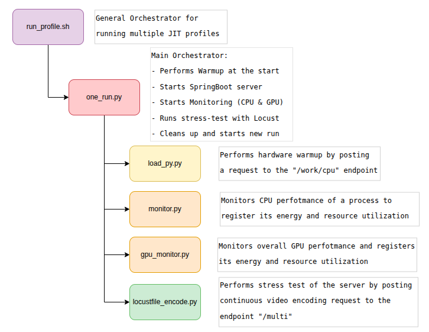

# DSICTS-team-7
 Repository of group 7 for the project of the course Designining Sustainable ICT Systems.

## Experiment Files
We here document our repository structure and main files used for the experiment.

The following diagram is a summary of the experiment workflow and used scripts, together with their role in the run.


As other important code files we consider:

- Server Side:
    - [`EncodeController.java`](jitlab/src/main/java/com/example/jitlab/api/EncodeController.java): server's controller that exposes the endpoint for a video transcoding request.
    - [`FfmpegCommandBuilder`](jitlab/src/main/java/com/example/jitlab/api/encoding/FfmpegCommandBuilder.java): responsible for contructing the appropriate ffmpeg command based on input parameters
    - [`EncodingService.java`](jitlab/src/main/java/com/example/jitlab/api/encoding/EncodingService.java): resposible for execution of ffmpeg commands

- Tools and scripts:
    - [`one_run_ffmpeg.py`](jitlab/tools/one_run_ffmpeg.py): script used to monitor a single ffmpeg run
    - [`run_ffmpeg_speed.sh`](jitlab/run_ffmpeg_speed.sh): script used to obtain average transcoding speed and power with GPU
    - [`plots_scripts`](jitlab/tools/plots_scripts/main.py): python module used to create comparison diagrams available in [/plots](plots/h264_GPU)

- Results:
    - Main experimental results are stored in [`/results`](jitlab/results/), which contains:
        - `h264-gpu/` → 7 JIT compiler profiles (baseline, c1-only, c2-only, interpret, heap, low-threshold, double-thread);
        - `hevc-gpu/` → baseline profile;
        - `av1-gpu/` → baseline profile.
    - Retrieved Carbon Intensity Factors can be found in [/emission-data](jitlab/emission-data)

---

## How to run

Before running, make sure to have executed a `sudo` command in the launching terminal to insert the password, beacause it is then used authomatically by the monitoring scripts. 

To recreate the experiment, you have to run the [`run_profile.sh`](jitlab/run_profiles.sh) script specifying the necessary parameters. To run what we did use the following command:

```bash
./run_profiles.sh -- --monitor-sudo --runSec 180 --timeout 90 --numberOfRepetitions 30 --warmupSec 90  --codec h264 --resolution 1080 --use-gpu true
```

Make sure to have the python dependencies installed on your local machine or on a virtual enviroment with:
```bash
pip install requirements.txt
```

FFmpeg must be installed and accessible from the command line.
```bash
ffmpeg --version
```
In order to reproduce our experiment the video we used can be found at: https://www.youtube.com/watch?v=iHdviZkM7S4

GPU-accelerated transcoding (--use-gpu true) is only supported on NVIDIA GPUs with NVENC hardware encoder support.
